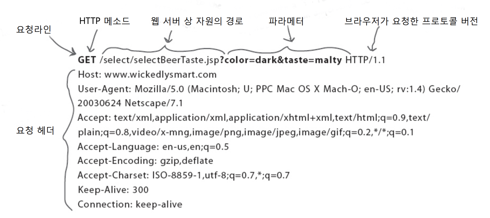

## 학습목표

-   웹 서버와 클라이언트는 무엇을 하나요, 어떻게 대화하죠?
-   2분짜리 HTML 가이드
-   HTML 프로토콜, 넌 누구냐!
-   HTTP GET, POST 요청 및 HTTP 응답을 해부해보자.
-   URL로 웹 페이지가 어디 있는지 어떻게 알지?
-   웹 서버, 정적인 웹 페이지 그리고 CGI
-   서블릿의 신비를 벗겨보자 : 작성, 배포, 실행
-   JSP는 'HTML에 자바를 넣을 순 없을까'라는 고민에서 탄생했다네요.

---

### 웹 서버는 어떤 일을 하나요?

웹 서버는 클라이언트로부터 요청을 받아, 요청한 것을 넘겨주는 일을 하지요. 사용자가 웹 브라우저로, 서버에 있는 자원(Resource)을 요청하는 것에서 부터 시작합니다. 요청은 웹 서버로 전달되고, 서버는 사용자가 요청한 것을 넘겨주는 것으로 작업이 끝납니다. 자원이라고 하는 것은 HTML 페이지가 될 수 있고, 그림(png, jpge, ..) 이나 음향 파일, PDF 파일이 될 수 있지요.

그것이 무엇이든 간에, 작동 원리는 _"클라이언트는 요청하고 서버는 이를 제공한다"_로 요약할 수 있습니다.


### 그럼 클라이언트는 무엇을 하나?

웹 클라이언트는 사용자가 서버에 요청을 보낼 수 있는 기능을 제공합니다. 요청을 보내고 난 다음, 서버가 보내온 요청의 결과를 화면에 출력하는 일도 클라이언트의 역할이죠. 브라우저는 서버랑 통신하는 크롬, 모질라, 사파리와 같은 소프트웨어를 말합니다. 브라우저의 주된 역할은 HTML 코드를 읽어서 화면에 보이는 것이죠. 클라이언트를 사람과 브라우저롤 구분하지 않고 총칭해서 _사용자가 요구한 대로 동작하는 웹 브라우저_라는 뜻으로 이해하면 무리가 없습니다.


### 클라이언트와 서버는 HTML과 HTTP를 어떻게 다룰지 압니다

 HTML                             

클라이언트로부터 요청을 받고 나면, 서버는 브라우저에게 컨텐츠 타입이 무엇인지 알려주죠. 브라우저는 이 내용에 기초하여 이를 어떻게 화면에 출력할지 준비합니다. 서버가 내려 보내는 것은 HTML이라는 명령문으로, 이는 브라우저가 화면에 컨텐츠를 어떻게 출력할지에 대한 명령(instruction)으로 이루어져 있습니다. 모든 웹 브라우저는 HTML을 이해합니다. ~물론 좀 오래된 브라우저들은 최신 HTML을 못 알아 듣기도 하지만...~

 HTTP                             

웹 상에서 일어나는 클라이언트와 서버간 대화는 거의 대부분 HTTP 프로토콜로 이루어집니다. HTTP 프로토콜은 요청과 응답으로 이루어진 아주 단순한 구조입니다. 클라이언트가 HTTP로 요청을 보내면, 서버는 HTTP 응답으로 대꾸하죠. 이게 다에요. 별거 없죠.

핵심 포인트는 당신이 웹 서버라면 HTTP로 상대와 대화한다는 겁니다. 웹 서버는 클라이언트로 HTML 페이지를 HTTP로 보냅니다.

### HTTP 프로토콜, 넌 누구냐!

HTTP는 TCP/IP 위에서 돌아갑니다. TCP는 한쪽 노드에서 다른쪽 노드로 파일을 보내는 녀석입니다. 물로 여러 개로 잘라서 보낼 수도 있지요. IP는 한 호스트에서 목적지 호스트까지 패킷을 옮기고 이동하기 위한 기반 프로토콜이라고 할 수 있죠. HTTP는 이와는 별개로 웹에서만 사용하는 프로토콜입니다. 

<table style="border-collapse: collapse; width: 100%;" border="1"><tbody><tr><td style="width: 50%;">요청의 주요 구성요소</td><td style="width: 50%;">응답에 주요 구성요소</td></tr><tr><td style="width: 50%;"><b>HTTP method</b> : 실행할 액션을 말합니다</td><td style="width: 50%;"><b>상태코드</b> : 요청이 성공했는지 아닌지 등</td></tr><tr><td style="width: 50%;">접근하고자 하는 페이지 <b>URL</b></td><td style="width: 50%;"><b>컨텐츠 타입</b> : 텍스트, 그림, HTML 등</td></tr><tr><td style="width: 50%;"><b>폼 파라미터</b> : 메소드의 매개변수와 비슷한 놈</td><td style="width: 50%;"><b>컨텐츠</b> : HTML 코드, 이미지 등</td></tr></tbody></table>

내가 서버라면 제일 먼저 알고 싶은 것은 아마 HTTP 메소드가 무엇인가가 아닐까요? HTTP 메소드는 이름만으로도 이것이 어떤 놈인지, 함께 들어올 정보가 어떤 형식인지 알 수 있습니다. HTTP 메소드는 여럿 있는데 그 중 가장 많이 사용하는 것은  GET과 POST 입니다.

### HTTP GET, POST 요청 및 HTTP 응답을 해부해보자

단순한 요청은 **GET**, 사용자가 입력한 정보를 함께 보내려면 **POST**

잠깐만, 난 서버한테 파라미터로 정보를 보내는 GET을 본 적이 있는데..

GET도 정보를 보낼 수 있다고요~ 이거 제대로 설명하고 있는거 맞나요?!! 

그게 사실이라면.. HTTP GET도 많지는 않지만 데이터를 보낼 수 있다는 말이군.

1.  GET으로는 보낼 수 있는 글자 수 제한이 있습니다. (서버에 따라 좀 다르기는 해도) 검색 입력 칸에 검색어를 끝도 없이 써 넣으면, 아마 GET이 작동하지 않을 수도 있겠죠?
2.  GET의 데이터 전송방식은 브라우저 주소란에 기입하는 URL 뒤에 붙이는 식입니다. 그러므로 중요한 데이터든 아니든 간에 화면에 다 보입니다. 그러니 패스워드처럼 민감한 데이터는 GET으로 보내지 않는 것이 현명하겠죠.
3.  위의 두 가지 이유로 해서 GET으로 전송하는 URL은 즐겨찾기에 등록할 수 있지만, POST는 대부분 그렇지 못합니다. 브라우저에 따라 폼의 Submit 결과를 즐겨찾기에 등록할 수도, 못할 수도 있습니다.


####  GET을 해부해봅시다           



####  POST도 해부해봅시다          


####  HTTP 응답을 해부해봅시다          


#### 한번에 다 보도록 하지요

1.  사용자가 주소창에 URL을 입렵합니다.
2.  브라우저는 이 정보로 HTTP GET 요청을 만듭니다.
3.  HTTP GET을 서버로 날려 보냅니다.
4.  서버는 요청한 페이지를 서버에서 찾고...
5.  HTTP 응답을 작성합니다.
6.  HTTP 응답을 클라이언트로 내려 보냅니다.
7.  브라우저는 HTML을 화면에 그립니다.

#### GET이냐 POST냐

<table style="border-collapse: collapse; width: 100%; height: 152px;" border="1"><tbody><tr style="height: 19px;"><td style="width: 13.5657%; height: 19px;"><b>POST</b></td><td style="width: 13.4497%; height: 19px;">GET</td><td style="width: 72.9845%; height: 19px;">사용자 이름과 패스워드를 넘겨주고 싶어요.</td></tr><tr style="height: 19px;"><td style="width: 13.5657%; height: 19px;"><span style="color: #333333;">POST</span></td><td style="width: 13.4497%; height: 19px;"><b><span style="color: #333333;">GET</span></b></td><td style="width: 72.9845%; height: 19px;">하이퍼링크로 새로운 페이지를 요청합니다.</td></tr><tr style="height: 19px;"><td style="width: 13.5657%; height: 19px;"><b><span style="color: #333333;">POST</span></b></td><td style="width: 13.4497%; height: 19px;"><span style="color: #333333;">GET</span></td><td style="width: 72.9845%; height: 19px;">채팅 방에서 대화 내용을 넘겨주고 싶어요.</td></tr><tr style="height: 19px;"><td style="width: 13.5657%; height: 19px;"><span style="color: #333333;">POST</span></td><td style="width: 13.4497%; height: 19px;"><b><span style="color: #333333;">GET</span></b></td><td style="width: 72.9845%; height: 19px;">다음 페이지를 보기 위해 '다음' 버튼을 클릭합니다.</td></tr><tr style="height: 19px;"><td style="width: 13.5657%; height: 19px;"><b><span style="color: #333333;">POST</span></b></td><td style="width: 13.4497%; height: 19px;"><span style="color: #333333;">GET</span></td><td style="width: 72.9845%; height: 19px;">보안이 중요한 은행 사이트에서 '로그아웃' 버튼을 클릭합니다</td></tr><tr style="height: 19px;"><td style="width: 13.5657%; height: 19px;"><span style="color: #333333;">POST</span></td><td style="width: 13.4497%; height: 19px;"><b><span style="color: #333333;">GET</span></b></td><td style="width: 72.9845%; height: 19px;">뒷 페이지로 돌아가기 위해서 '뒤로' 버튼을 클릭합니다.</td></tr><tr style="height: 19px;"><td style="width: 13.5657%; height: 19px;"><b><span style="color: #333333;">POST</span></b></td><td style="width: 13.4497%; height: 19px;"><span style="color: #333333;">GET</span></td><td style="width: 72.9845%; height: 19px;">서버에 사용자의 이름과 주소를 넘겨주고 싶어요.</td></tr><tr style="height: 19px;"><td style="width: 13.5657%; height: 19px;"><b><span style="color: #333333;">POST</span></b></td><td style="width: 13.4497%; height: 19px;"><b><span style="color: #333333;">GET</span></b></td><td style="width: 72.9845%; height: 19px;">사용자가 라디오 버튼으로 값을 선택하도록 하고 싶어요.</td></tr></tbody></table>

### URL로 웹 페이지가 어디 있는지 어떻게 알지?

**https://ruby-1009.tistory.com:80/manage/newpost/index.html**

<table style="border-collapse: collapse; width: 100%;" border="1"><tbody><tr><td style="width: 20.3488%; text-align: left;"><span style="color: #333333;">https://</span></td><td style="width: 79.6512%; text-align: left;"><span style="color: #333333;">프로토콜(Protocol) 서버와 대화하기 위하여 사용하는 커뮤니케이션 프로토콜</span></td></tr><tr><td style="width: 20.3488%; text-align: left;"><span style="color: #333333;">ruby-1009.tistory.com</span></td><td style="width: 79.6512%; text-align: left;">서버(Server) 당신이 찾던, 인터넷 상에 둘도 없는 이름. 이 이름은 IP 주조에 매핑되죠. 근데 왜 IP 주소를 직접 사용하지 않는 거냐고요? 쉽게 기억하기 위해서 입니다. 숫자보다는 이름이 휠씬 기억하기 쉽잖아요.</td></tr><tr><td style="width: 20.3488%; text-align: left;"><span style="color: #333333;">:80</span></td><td style="width: 79.6512%; text-align: left;">포트(Port) 포트는 URL에서 옵션입니다. 자동차 옵션처럼 달 수도 있고, 달지 않을 수도 있다는 말입니다. 포트도 마찬가지입니다. 포트 번호로 어떤 서버 어플리케이션이 서비스 되는지 알 수 있습니다. URL에 포트가 없다면, '80'이 디폴트로 생략되어 있다고 생각하세요.</td></tr><tr><td style="width: 20.3488%; text-align: left;"><span style="color: #333333;">/manage/newpost</span><span style="color: #333333;">/</span></td><td style="width: 79.6512%; text-align: left;">서버에서 자원의 위치</td></tr><tr><td style="width: 20.3488%; text-align: left;"><span style="color: #333333;">index.html</span></td><td style="width: 79.6512%; text-align: left;">자원(Resource) 요청된 컨텐츠 이름입니다. 여기서는 HTML 페이지를 요청해군요.</td></tr></tbody></table>

### 서버, 정적인 웹 페이지 그리고 CGI

웹 서버는 정적인 페이지 서비스가 전공입니다. 정적인 페이지는 디렉토리에 있는 파일 그대로 입니다. 서버는 단지 파일을 찾아서 있는 그대로 클라이언트에게 넘겨줄 뿐이지요. 즉 모든 클라이언트가 동일한 결과를 보겠지요. 만약에 페이지에 현재 시간을 보여주고 싶은 경우에는 어떻게 할까요? 즉 뭔가 동적인 정보를 원하는 경우 말이죠. HTML 안에 변수를 집어 넣을 수 있을까요?

가끔 웹 서버가 좀 더 똑똑했으면 할 때가 있습니다. 웹 서버 혼자서 할 수 없는 두 가지는 다음과 같습니다. 만약 요청이 날아가기 바로 전까지 존재하지 않았던 페이지를 바로 그 자리에서 만들고자 하는 경우, 또는 파일이나 데이터베이스에 데이터를 저장하고자 하는 경우, 이런 일은 웹 서버 혼자서는 불가능 합니다.

웹 서버는 단지 정적인 페이지만 제공할 뿐입니다. 그러나 도우미 어플리케이션이 웹 서버와 협력해서 동적인, 실시간으로 작성한 페이지를 제공할 수 있습니다. 서버 상에 데이터를 저장할 때에도 웹 서버는 자신을 도와줄 어플리케이션에게 SOS 요청을 합니다. 웹 서버는 파라미터를 어플리케이션에 넘겨주고, 응답하도록 부탁합니다. 이런 도우미 어플리케이션을 CGI 프로그램이라고 부릅니다. 서블릿과 CGI 둘다 도우미 어플리케이션 입니다.


---


### 서블릿의 신비를 벗겨보자 : 작성, 배포, 실행

```
import javax.servlet.*;
import javax.servlet.http.*;
import java.io.*;

public class Ch1Servlet extends HttpServlet {
	public void doGet(HttpServletRequest request,
    			HttpServletResponse response) throws IOException {
    	PrintWriter out = response.getWriter();
        java.util.Date today = new java.util.Date();
        out.println("<html><body>" +
                    "<h1>Chapter1 Servlet</h1>" +
                    "<br />" + today + "</body></html>");
	}
}
```

```
<web-app>
	<servlet>
    	<servlet-name>Chapter1 Servlet</servlet-name>
        <servlet-class>Ch1Servlet</servlet-class>
    </servlet>
    <servlet-mapping>
    	<servlet-name>Chapter1 Servlet</servlet-name>
        <url-pattern>/Serv1</url-pattern>
    </servlet-mapping>
</web-app>
```

```
%javac -classpath /your path/tomcat/common/lib/servlet-api.jar -d classes src/Ch1Servlet.java
%bin/startup.sh
%bin/shutdown.sh
```


### JSP는 'HTML에 자바를 넣을 순 없을까'라는 고민에서 탄생했다네요.

HTML 페이지 디자이너들은 대부분 자바를 모릅니다. 어플리케이션 개발자들은 자바를 잘 알죠. 웹 페이지 디자이너들은 HTML은 알아도 자바는 모르죠. JSP로 개발하면 자바 개발자는 자바를 쓰면 되고, HTML 개발자는 HTML을 쓰면 됩니다. 그것이 가능하다는 말입니다.

HTML 페이지를 자바 String 변수에 넣는 것은 악몽입니다. 복잡한 HTML 코드를 자바 String 안에다 넣으려는 순간 여러분 앞에는 수많은 컴파일 에러가 기다리고 있을 겁니다. 아마 HTML 코드가 사용자 브라우저에서 생각하던 대로 나오게 하려면 엄청난 시간과 정열을 투자해야 합니다. String에는 줄바꿈 문자를 포함할 수 없습니다. 쌍따옴표(") 글자도 처리하기 골치 아픈 것 중 하나지요. HTML에는 얼마나 많은 "이 있는지 알고 있죠? 태그의 속성이 죄다 "로 둘러싸여 있습니다. " 문자를 찾아 \\(escape code)를 집어넣어야 하기 때문이죠. 이 작업은 하나라도 빠지면 오류가 발생하는 아주 짜증스러운 일이기도 합니다.

#### **핵심 정리**

-   HTTP는 하이퍼텍스트 전송 프로토콜(HyperText Transfer Protocol)의 약자입니다. HTTP는 웹에서 사용하는 네트워크 프로토콜이며 TCP/IP 위에서 돌아갑니다.
-   HTTP는 요청/응답(Request/Response) 모델을 사용합니다. 즉 클라이언트는 HTTP Request를 보내고, 웹 서버는 HTTP Response로 응답합니다. 그러면 브라우저는 내려받은 컨텐츠 타입에 따라 문서를 출력합니다.
-   서버로부터 온 문서가 HTML이라면, 이 HTML 페이지는 HTTP 응답에 첨부되어 날아옵니다.
-   HTTP 요청에는 요청한 URL(클라이언트가 요청한 자원), HTTP 메소드(GET, POST 등), 파라미터 데이터(없을수도 있음, 보통 쿼리 스트링이라고 부름)가 들어 있습니다.
-   HTTP 응답에는 상태코드, 컨텐츠 타입(보통 MIME이라고 부른다), 실제 컨텐츠(HTML, 이미지 등)가 들어 있습니다.
-   GET 메소드는 폼 데이터를 URL 뒤에 추가합니다.
-   POST 메소드는 요청의 몸체(body)에 폼 데이터를 포함합니다.
-   MIME 타입은 브라우저에게 "어떤 종류의 데이터를 받을 겁니다"라는 정보를 미리 알려주어, 브라우저가 이 데이터를 어떻게 다룰지 준비하도록 합니다(HTML이면 화면에 보여주기 위한 작업을 해야 할 것이고, 이미지라면 포맷을 파악하여 출력할 것이며, 음악은 또 그에 맞는 행동을 하겠지요)
-   URL은 Uniform Resource Locator의 약자입니다. 웹에 있는 모든 자원은 자신만의 고유한 주소를 가집니다. 제일 앞에는 프로토콜의 종류, 그 다음은 서버이름, 포트번호(기본값이 아닌 경우), 자원이 있는 경로와 마지막으로 자원의 이름이 뒤따라 옵니다. 여기에 쿼리 스트링이 있다면 추가될 수 있습니다. 물론 GET 메소드인 경우에 말입니다.
-   웹 서버는 정적인 페이지를 서비스하는데 최적화되어 있습니다. 예를 들어, 현재 시간을 페이지에 보여주려고 할 때와 같이, 동적인 페이지를 만들어야 한다면, 서버와 협업하여 이를 처리할 수 있는 도우미 애플리케이션(helper app)이 있어야 합니다. 자바 이외의 이런 프로그램을 CGI라고 부릅니다. CGI는 Common Gateway Interface의 약어입니다.
-   HTML을 println() 안에 작성하는 방식은 컴파일 오류를 내기 쉬우며, 관리하기도 쉽지 않습니다. JSP는 자바 안에다 HTML을 작성하는 방식이 아니라, HTML 안에다 자바 코드를 작성하는 방식으로 이 문제를 해결합니다.
